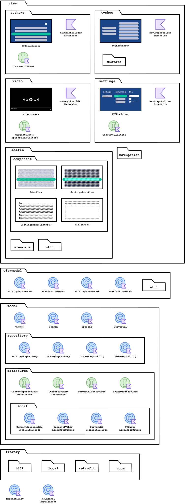
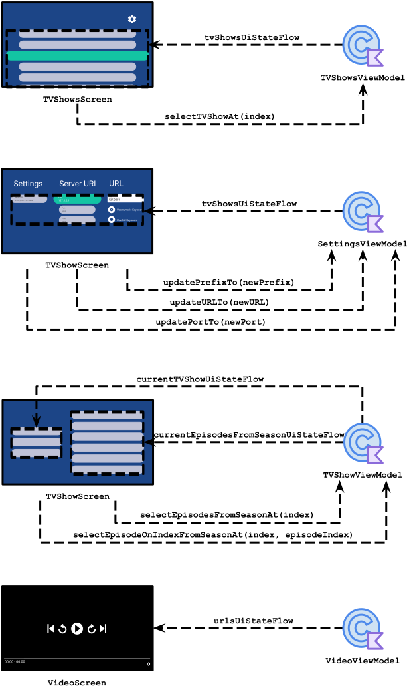
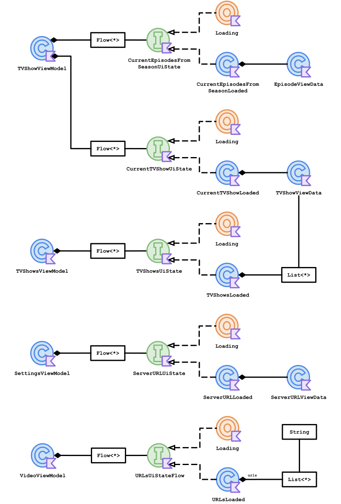

<h1 align="center">
   
  Mo Channel
</h1>

  <strong>See your own channel with videos hosted in your computer!</strong> 
  This Android TV application allows you to watch videos hosted on your own computer on your TV.

- [Usage](#usage)
- [Use Cases](#use-cases)
- [Technologies](#technologies)
- [Structure](#structure)
- [Diagrams](#diagrams)
  - [Package `io.schiar.ruleofthree`](#package-ioschiarruleofthree)
  - [Package `view` with `viewmodel`](#package-view-with-viewmodel)
  - [Package `view.viewdata`](#package-viewviewdata)
  - [Package `viewmodel` with `view.viewdata`](#package-viewmodel-with-viewviewdata)
- [Future Tasks](#future-tasks)

## Usage
  This application requires downloading the [mo-channel-server](https://github.com/giovanischiar/mo-channel-server) executable on the machine where the videos are located in order to be available to the application.

## Use Cases
|||
|:-:|:-:|
|||
||This is the app when you open it for the first time. Since the Server URL is empty, it opens the settings to input the Server URL. If you are running the server on your computer, you'll need to input the IP number the server will tell you, along with the port number.|
|||
||Here is the screen with some content registered. In this example, you can store concerts you've recorded on your computer, run the [mo-channel-server](https://github.com/giovanischiar/mo-channel-server), and input the URL in the settings.|
|||
||This is the page when you press on one item. It shows the 'episodes' per 'season'. Episodes are the videos, while 'season' refers to the subfolder where you put the videos.|

# Technologies
|Technology|Purpose|
|:-:|:-:|
| [Jetpack Compose](https://developer.android.com/jetpack/compose)|Design UI|
| [Exoplayer](https://github.com/google/ExoPlayer)|The video player used by this application|
| [Room](https://developer.android.com/jetpack/androidx/releases/room)|Persist application data|

## Structure
  Please check [my other project](https://github.com/giovanischiar/fridgnet?tab=readme-ov-file#structure) to learn more about the notation I used to create the diagrams in this project.

## Diagrams

### Package `io.schiar.ruleofthree`
  This diagram shows all the packages the application has, along with their structures. Some packages are simplified, while others are more detailed.

  <picture>
    <source media="(prefers-color-scheme: dark)" srcset="./readme-res/diagrams/dark/io-schiar-mochannel-structure-diagram.dark.svg">
    
  </picture>

### Package `view` with `viewmodel`
  These diagrams illustrate the relationship between screens from `view` and `viewmodel` classes. The arrows from the View Models represent View Data objects (classes that hold all the necessary data for the view to display), primitives, or collections encapsulated by [State Flows](https://kotlinlang.org/api/kotlinx.coroutines/kotlinx-coroutines-core/kotlinx.coroutines.flow/-state-flow/), which are classes that encapsulate data streams. Every update in the View Data triggers the State Flow to emit these new values to the `view`, and the view updates automatically. Typically, the methods called from screens in `view` to classes in `viewmodel` trigger these changes, as represented in the diagram below by arrows from the `view` screens to `viewmodel` classes.

  <picture>
    <source media="(prefers-color-scheme: dark)" srcset="./readme-res/diagrams/dark/view-viewmodel-diagram.dark.svg">
    
  </picture>

### Package `view.viewdata`
  View Datas are classes that hold all the data the `view` needs to present. They are created from `model` classes and served by View Models to the `view`. This diagram represents all the associations among the classes in the `view.viewdata`.

  <picture>
    <source media="(prefers-color-scheme: dark)" srcset="./readme-res/diagrams/dark/viewdata-diagram.dark.svg">
    
  </picture>

### Package `viewmodel` with `view.viewdata`
  View Models serve the `view` with objects made from `viewmodel.viewdata` classes, collections, or primitive objects encapsulated by State Flows. This diagram represents all the associations among the classes in `viewmodel` and `view.viewdata`.

  <picture>
    <source media="(prefers-color-scheme: dark)" srcset="./readme-res/diagrams/dark/viewmodel-viewdata-diagram.dark.svg">
    
  </picture>

## Future Tasks
  - Create Tests.
  - Add [IconCreator](https://github.com/giovanischiar/icon-creator) (my own library).
  - Work with multiples servers at the same time.